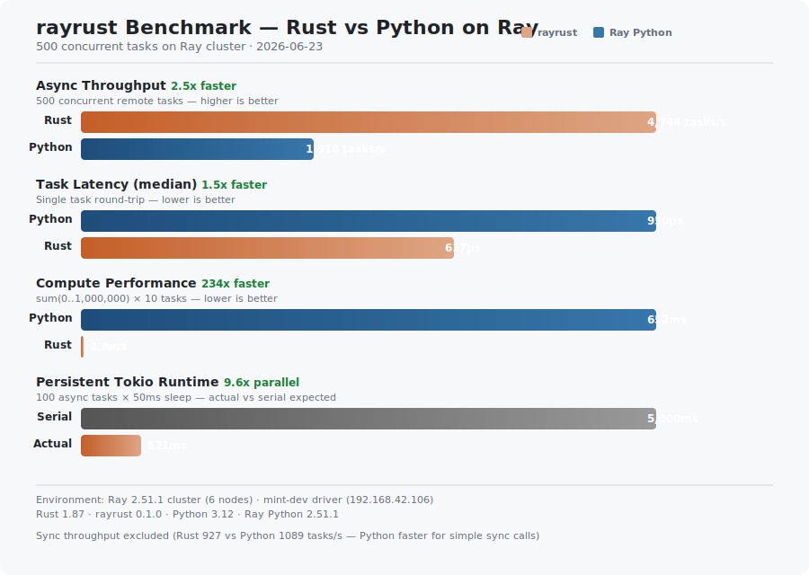

# rayrust

[English](README.md) | [中文](README_CN.md)

Ray 的 Rust SDK —— 通过 FFI 封装 Ray C++ SDK，提供地道的 Rust API 来使用 Ray 的核心分布式原语：对象存储、远程任务、Actor、Placement Group 和跨语言调用。

## 特性

| 特性 | 本地模式 | 集群模式 |
|---|:---:|:---:|
| `init` / `shutdown` | ✅ | ✅ |
| `put` / `get` / `wait` | ✅ | ✅ |
| `get_many`（批量获取） | ✅ | ✅ |
| `#[remote]` 同步任务 | ✅ | ✅ |
| `#[remote]` 异步任务（持久化 runtime） | ✅ | ✅ |
| `#[actor]` 宏（自动生成 factory + 方法） | ✅ | ✅ |
| `actor_call_async`（非阻塞） | ✅ | ✅ |
| `get_async`（eventfd + AsyncFd，零线程阻塞） | ✅ | ✅ |
| Python 任务（跨语言，复杂类型） | ✅ | ✅ |
| Python Actor（跨语言） | ✅ | ✅ |
| 资源调度（`CPU`、`GPU`） | ✅ | ✅ |
| PlacementGroup | ✅ | ✅ |
| `get_actor` / `cancel` / `kill` | ✅ | ✅ |
| XLANG header 自动检测（兼容 Ray 2.51.1+） | ✅ | ✅ |
| `rmpv::Value` 动态反序列化 | ✅ | ✅ |
| `put_xlang`（xlang 数据存入 object store） | ✅ | ✅ |
| `ray_last_error()`（线程局部错误消息） | ✅ | ✅ |

## 快速开始

### 前置条件

**无需安装 Python。** 构建系统会自动从 PyPI 下载 Ray C++ SDK：

```bash
git clone https://github.com/NolanHo/rayrust.git
cd rayrust
cargo build --release -p rayrust-example-worker
```

首次构建会从 PyPI 下载 Ray wheel（约 71MB），提取 C++ SDK 到 `~/.cache/rayrust/`。后续构建复用缓存。

**可选：** 使用已安装的 Ray C++ SDK（如 `pip install ray[cpp]`）：

```bash
export RAY_CPP_DIR=/path/to/site-packages/ray/cpp
```

### 本地模式运行（无需集群）

```bash
cargo run --example hello_ray
```

### 集群模式运行

```bash
export RAY_ADDRESS='<head节点IP>:6379'
export RAY_NODE_IP='<本机IP>'
export RAY_WORKER_SO="$(pwd)/target/release/librayrust_worker.so"
export LD_LIBRARY_PATH="$HOME/.cache/rayrust/ray-cpp-2.51.1/lib:$LD_LIBRARY_PATH"

cargo run --example full_test
```

## 使用方式

### 远程任务（`#[remote]`）

支持同步和 `async fn`。异步函数使用持久化全局 tokio runtime（创建一次，复用调用）。

```rust
use rayrust::prelude::*;

#[rayrust::remote]
fn add(a: i32, b: i32) -> i32 { a + b }

#[rayrust::remote]
async fn fetch(url: String) -> Vec<u8> { /* ... */ }

#[tokio::main]
async fn main() -> Result<(), RayError> {
    let ray = Ray::connect(&RayConfig::new("127.0.0.1:6379"))?;

    // 同步提交 + 异步获取（零线程阻塞）
    let r = add_remote(&ray, 1, 2);
    let v: i32 = r.get_async().await?;
    println!("add(1, 2) = {}", v);

    // 异步提交（并发）
    let r = add_remote_async(&ray, 10, 20).await?;
    let v: i32 = r.get_async().await?;

    drop(ray);
    Ok(())
}
```

### Actor（`#[actor]` 宏）

`#[rayrust::actor]` 宏自动生成 factory callback、成员函数 callback、`#[ctor]` 注册和便捷调用函数：

```rust
use rayrust::prelude::*;

struct Counter { value: i64 }

#[rayrust::actor]
impl Counter {
    fn new(start: i64) -> Self {
        Counter { value: start }
    }

    fn increment(&mut self, n: i64) -> i64 {
        self.value += n;
        self.value
    }

    fn get(&self) -> i64 {
        self.value
    }
}

#[tokio::main]
async fn main() -> Result<(), RayError> {
    let ray = Ray::connect(&RayConfig::new("127.0.0.1:6379"))?;

    // 通过宏生成的 factory 创建 Actor
    let arg = serialize(&100i64)?;
    let handle = ray.actor_create(
        "__rayrust_actor_factory_counter", &[&arg], &ActorOptions::new()
    )?;

    // 异步调用方法
    let arg = serialize(&5i64)?;
    let r = ray.actor_call_async(
        handle.id(),
        "__rayrust_actor_factory_counter::increment",
        vec![arg],
    ).await?.cast::<i64>();
    let v = r.get_async().await?; // 105

    ray.kill_actor(&handle, true)?;
    drop(ray);
    Ok(())
}
```

### 跨语言调用（Python）

Rust ↔ Python，自动处理 XLANG header，支持复杂类型：

```rust
// Python → Rust: list、dict、nested、None、混合类型
let obj = ray.task_call_python("my_module", "return_list", &[], &[])?;
let val: Vec<i64> = obj.cast().get_async().await?; // [1, 2, 3, 4, 5]

// 动态类型（返回类型未知时）
let obj = ray.task_call_python("my_module", "complex_func", &[], &[])?;
let val = obj.get_value_async().await?; // rmpv::Value

// Rust → Python: 发送复杂参数
let arg = serialize(&vec![1i64, 2, 3])?;
let obj = ray.task_call_python("my_module", "echo_list", &[&arg], &[])?;
```

### 资源调度

为 task 和 actor 请求 CPU/GPU 资源：

```rust
// 带 GPU 的 task
let obj = ray.task_call(
    "train_model", &args, &[], &TaskOptions::new().resource("GPU", 1.0).resource("CPU", 4.0)
)?;

// 带资源的 actor
let handle = ray.actor_create(
    "gpu_actor_factory", &args, &ActorOptions::new().resource("GPU", 1.0)
)?;
```

### 对象存储

```rust
let obj = ray.put(&42i32)?;
let val: i32 = ray.get(&obj)?;

// 异步 put/get
let obj = ray.put_async(42i32).await?;
let val: i32 = obj.get_async().await?;

// 批量获取
let vals = ray.get_many(&[obj1, obj2, obj3])?;

// 等待就绪
let (ready, unready) = ray.wait(&[obj1, obj2], 2, 5000)?;
```

## 架构

```
Rust 应用代码
    |
    v
rayrust（安全 Rust API）
    ObjectRef<T>, ActorHandle, #[remote]/#[actor] 宏
    get_async (eventfd + AsyncFd), 持久化 tokio runtime
    |
    v
rayrust-sys（FFI 绑定）
    extern "C" 声明, build.rs (从 PyPI 自动下载 SDK)
    |
    v
ray_c.h / ray_c.cc（C ABI 封装层）
    类型擦除的 C 接口, 二进制安全的 ID
    线程局部错误消息, 资源调度
    |
    v
libray_api.so（Ray C++ SDK）  ->  Ray Core (raylet / GCS / object store)
```

## 构建系统

`rayrust-sys` 的 `build.rs` 处理 SDK 获取：

1. **`RAY_CPP_DIR` 环境变量** — 使用已安装的 SDK
2. **`~/.cache/rayrust/ray-cpp-{version}/`** — 共享缓存（debug + release）
3. **从 PyPI 自动下载** — 下载 wheel，提取 `ray/cpp/`

通过 `RAY_VERSION=2.51.1` 覆盖 Ray 版本。

## 关键设计决策

| 决策 | 原因 |
|---|---|
| 封装 C++ SDK，非原生重写 | `libray_api.so` 是 38MB 的 Bazel 产物 |
| C ABI 封装层 | C++ 模板无稳定 ABI |
| build.rs 自动下载 | 构建不依赖 Python 环境 |
| 二进制安全 ID（`ptr + len`） | Ray ObjectID 可能包含 null 字节 |
| XLANG header 自动检测 | Ray 2.51.1+ 改变了 header 格式（非零 padding） |
| `rmpv::Value` 动态类型 | Python 返回类型编译时未知 |
| 持久化全局 tokio runtime | 避免每次调用创建 runtime 的开销 |
| `#[actor]` 宏 | 将 40 行样板代码减少到 10 行 |
| 线程局部 `ray_last_error()` | 从 C++ 到 Rust 的结构化错误传递 |

## 性能基准

Rust vs Python 在 Ray 集群上（500 个任务）：



| 指标 | Rust | Python | 加速比 |
|---|---|---|---|
| 异步吞吐 | 4744 tasks/sec | 1918 tasks/sec | **2.5x** |
| 延迟（中位数） | 617µs | 950µs | **1.5x** |
| 计算（sum 0..1M） | 2.8ms | 652ms | **234x** |
| 异步 runtime（100×50ms） | 521ms（9.6x 并行） | — | — |

## 集群配置

### 多节点 C++ Actor 支持

Rust Actor 使用 Ray C++ SDK 的 worker 进程（`default_worker`）。每个可能运行 C++ Actor 的节点**必须**安装 `ray[cpp]`：

```bash
# 在所有 worker 节点上（不仅仅是 driver 节点）：
pip install "ray[cpp]==2.51.1"
```

如果节点只安装了 `pip install ray`（仅 Python，没有 `[cpp]`），则缺少：
- `ray/cpp/default_worker` — Ray raylet 启动的 C++ worker 二进制
- `ray/cpp/lib/libray_api.so` — C++ SDK 共享库

C++ Actor 被调度到此类节点会立即崩溃（`never_started: true`，`NODE_DIED`）。

**症状**：`actor_create()` 成功（返回 actor ID），但 `actor_call()` 超时挂起。Driver 日志显示 `NODE_DIED`。

**快速检查** — 验证各节点的 C++ SDK：
```bash
ssh <worker-node> 'test -f $(python3 -c "import ray,os;print(os.path.join(os.path.dirname(ray.__file__),\"cpp\",\"default_worker\"))") && echo "C++ SDK OK" || echo "缺失: 请安装 ray[cpp]"'
```

**变通方案**：如果只有 driver 节点有 C++ SDK，使用 local mode 或单节点集群：
```bash
ray start --head --port=6380  # 在安装了 ray[cpp] 的节点上
```

### 远程任务 vs Actor

| 功能 | 需要 worker 节点安装 `ray[cpp]`？ | 原因 |
|---|---|---|
| `put` / `get` / `wait` | 否 | 在 driver 进程内执行 |
| `#[remote]` task | 否 | 在 driver 的 local worker 执行 |
| `#[actor]`（集群模式） | **是** | Ray 在 worker 节点启动 `default_worker` |
| `#[actor]`（本地模式） | 否 | 全部在进程内 |
| Python task/actor（xlang） | 否 | 使用 Python worker（所有节点可用） |

## 示例

| 示例 | 描述 |
|---|---|
| `hello_ray` | 基本的 put/get/init |
| `full_test` | 全功能测试（task、actor、xlang、placement group） |
| `async_demo` | tokio 并发异步任务 |
| `xlang_complex` | 跨语言复杂类型（11 项测试） |
| `actor_e2e` | Rust actor 端到端测试（`#[actor]` 宏） |
| `raybench` | 性能基准（Rust vs Python） |

## License

Apache-2.0（与 Ray 一致）
